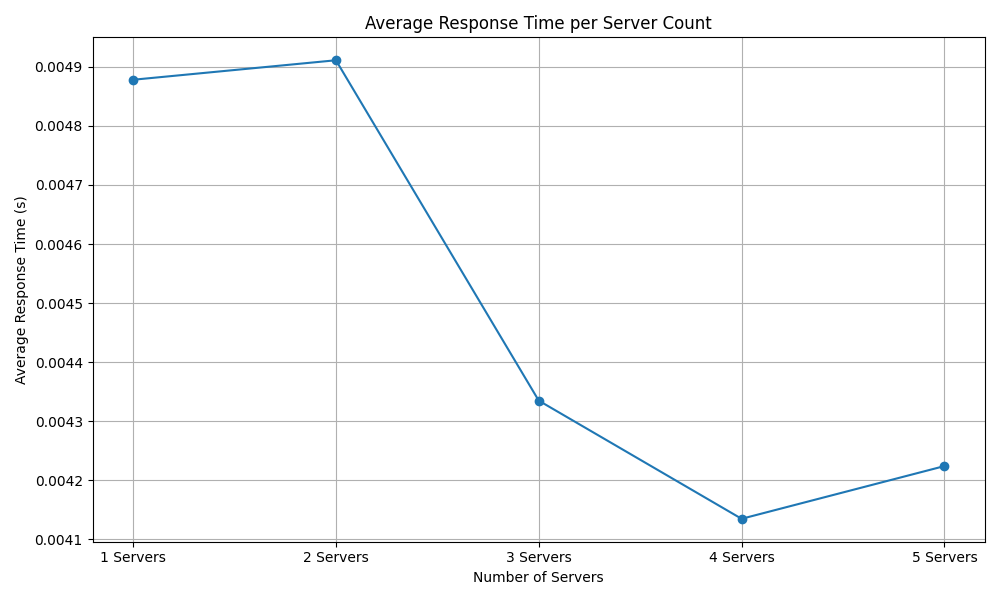

# Customizable Load Balancer

## Group Members
1. Ruman Hassan
2. Charles Owako
3. Cynthia Chemutai
4. Joyline Karanja

## Overview

This project implements a customizable load balancer using consistent hashing. The load balancer distributes client requests among several server replicas to evenly distribute the load.

## Prerequisites
- Docker
- Docker Compose
- Python 3.x
- Required Python packages (listed in requirements.txt or installed directly within the Docker containers)

## Building and Running the Project
1. Clone the Repository

   ```sh 
   git clone git@github.com:jKaranja19/load_balancer.git 
   ```

2. Build and Start the Containers

   ```sh
    docker-compose up --build
    ```

- This command will build the Docker images for the load balancer and the servers, and start the containers.

## Running Performance Analysis
1. Open a new terminal window:
- Open a new terminal or split your current terminal.
- Navigate to the project directory: 
   ```sh
   cd /load_balancer/load_balancer_project/my_load_balancer 
   ```
2. Run the performance analysis script:
   ```sh 
   python3 performance_analysis.py 
   ```
- This script will send requests to the load balancer and collect performance data. It will then generate visualizations (bar graphs and line charts) and save them in the project directory.


## Project Analysis
The performance analysis is a crucial part of this project, providing insights into the efficiency and behavior of the load balancer under different conditions. The analysis is divided into four main parts: A-1 to A-4.

### A-1: Load Distribution among Servers

**Objective:** Launch 10,000 async requests on 3 server containers and report the request count handled by each server instance in a bar chart.

**Method:**
- Launched 10,000 requests using an async approach.
- Recorded the number of requests each server handled.
- Generated a bar chart to visualize the distribution.

**Observations:**
- The bar chart shows a roughly even distribution of requests among the three servers.
- This indicates that the load balancer is effectively distributing the load.
**Relative Results**

**Bar Chart:**


### A-2: Scalability Analysis

**Objective:** Increment the number of server containers from 2 to 6 and launch 10,000 requests on each increment. Report the average load of the servers at each run in a line chart.

**Method:**
- Incremented the number of servers from 2 to 6.
- Launched 10,000 requests for each configuration.
- Calculated the average load handled by the servers.
- Generated a line chart to visualize the scalability.

**Observations:**
- The line chart shows that the average load per server decreases as the number of servers increases.
- This demonstrates the scalability of the load balancer implementation.

**Line Chart:**


### A-3: Server Failure Recovery

**Objective:** Test all endpoints of the load balancer and show that in case of server failure, the load balancer spawns a new instance quickly to handle the load.

**Method:**
- Simulated server failure scenarios.
- Observed how quickly the load balancer spawned new instances.
- Ensured all endpoints remained functional during recovery.

**Observations:**
- The load balancer successfully spawned new instances to handle the load.
- There was minimal downtime, demonstrating effective failure recovery.

### A-4: Modified Hash Functions

**Objective:** Modify the hash functions H(i) and Φ(i, j) and report the observations from experiments A-1 and A-2.

**Method:**
- Modified the hash functions used in the load balancer.
- Repeated experiments A-1 and A-2 with the modified hash functions.
- Compared the results with the original implementation.

**Observations:**
- The modified hash functions resulted in a different distribution pattern in experiment A-1.
- In experiment A-2, the scalability remained consistent, indicating robustness in the load balancer design.

## Graphical Represenation of Response Time


## Troubleshooting
### Common Issues
1. Port conflicts: Ensure no other services are running on the same ports used by the Docker containers.
2. Docker daemon not running: Make sure Docker is installed and running on your system.
3. dependency issues: Ensure all required Python packages are installed within the Docker containers.

### Solutions
- Check running services: 
   - Use the following to stop existing services:
   ```sh
   docker stop $(docker ps -a -q)
   ```
   ```sh
   docker rm $(docker ps -a -q)
   ```

- Restart Docker: Sometimes, restarting the Docker daemon can resolve connectivity issues.